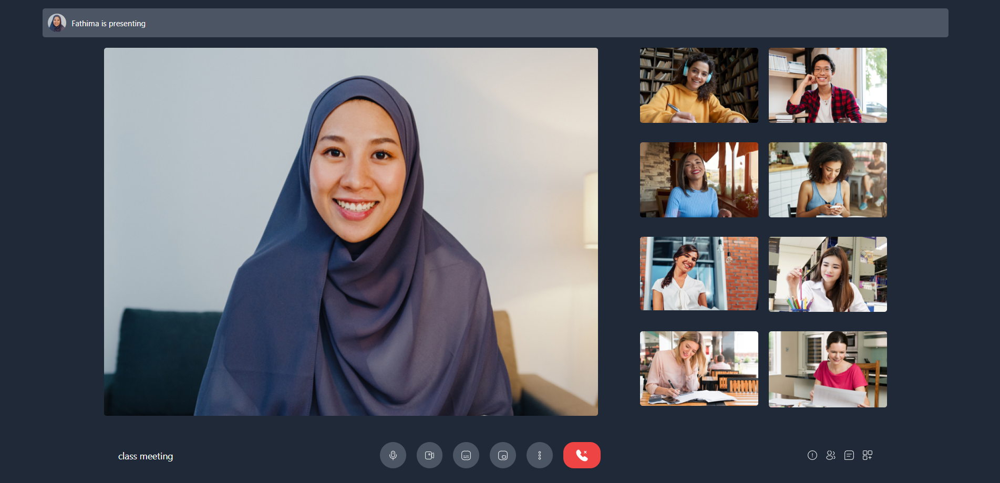

# React video chat

react video chat app side project that build with reactjs and tailwindcss
for frontend and nodejs , socketio and peerjs for backend realtime video and messaging chat app

## How to run the project?

1. Clone this repository in your local system.
2. Open the command prompt from your project directory and run the command `npm install`.
3. Open the command prompt from your project directory and run the command `npm start`.
5. Hurray! That's it.

